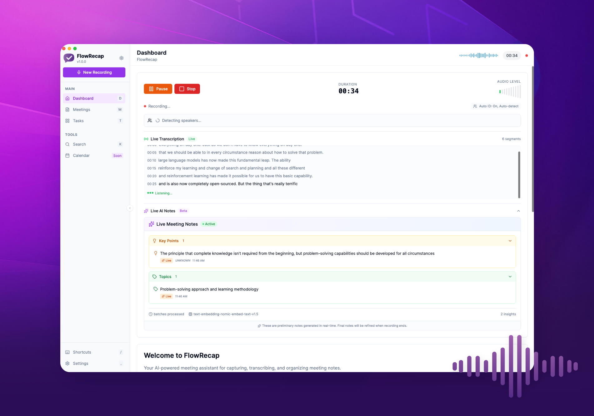

<p align="center">
  
</p>

<h1 align="center">FlowRecap</h1>

<p align="center">
  <strong>AI-Powered Meeting Notes & Transcription</strong>
</p>

<p align="center">
  Capture, transcribe, and organize your meetings with intelligent speaker identification and automatic action item extraction.
</p>

<p align="center">
  <a href="#features">Features</a> •
  <a href="#ai-providers">AI Providers</a> •
  <a href="#installation">Installation</a> •
  <a href="#quick-start">Quick Start</a> •
  <a href="#usage">Usage</a> •
  <a href="#development">Development</a> •
  <a href="#license">License</a>
</p>

<p align="center">
  
</p>

---

## Features

### Meeting Creation & Recording
- **One-Click Recording** - Start capturing meetings instantly from the dashboard
- **Multiple Meeting Types** - Support for one-on-one, team meetings, webinars, and custom types
- **Real-Time Audio Visualization** - Monitor audio levels during recording
- **Flexible Audio Quality** - Choose from 64-256 kbps or lossless WAV recording
- **Pause & Resume** - Control your recording without losing context

### Live Transcription & Speaker Identification
- **WhisperX Integration** - Fast, accurate speech-to-text with word-level timestamps
- **Multi-language Support** - Transcribe meetings in multiple languages
- **Automatic Speaker Diarization** - Identify and separate multiple speakers using pyannote.audio (no AI required)
- **Speaker Management** - Assign names to speakers and track their contributions
- **Configurable Sensitivity** - Adjust speaker detection thresholds (2-10 speakers)
- **Confidence Scoring** - Quality assurance for transcription accuracy

### Meeting Notes & Insights
After recording, FlowRecap provides comprehensive meeting intelligence:

| Feature | Description |
|---------|-------------|
| **Meeting Summary** | AI-generated comprehensive overview of the entire meeting |
| **Action Items** | Extracted tasks with assignee, priority (urgent/high/medium/low), and due dates |
| **Key Decisions** | Important decisions made during the meeting |
| **Key Points** | Highlighted important topics and conclusions |
| **Topics Timeline** | Main themes discussed with timestamps |

### Real-Time Live Insights (During Recording)
While recording, FlowRecap can extract insights in real-time:
- **Live Action Items Panel** - Tasks detected as they're mentioned
- **Live Decisions Panel** - Decisions identified in real-time
- **Live Key Points** - Important points highlighted as they occur
- **Topics Timeline** - Track topics as the meeting progresses
- **Speaker Participation** - Real-time speaker identification and participation metrics

### Task Management
- **Kanban Board** - Visual task management across all meetings
- **Priority & Assignment** - Track ownership, due dates, and priorities (urgent/high/medium/low)
- **Status Tracking** - Pending, in progress, completed, or cancelled
- **Cross-Meeting View** - See all action items from all meetings in one unified view
- **Filter & Sort** - Find tasks by status, priority, assignee, or date

### Professional Organization
- **Meeting Dashboard** - Quick overview of recent meetings and stats
- **Full-Text Search** - Search across all transcripts, notes, and action items
- **Meeting History** - Browse all past meetings with status indicators
- **Export Options** - Export to PDF, CSV, and other formats
- **Audio Playback** - Listen back to any part of your meeting

---

## AI Providers

FlowRecap uses AI to generate meeting summaries, extract action items, identify decisions, and highlight key points. The app follows a **local-first philosophy** - your data stays on your machine.

### Supported Providers

| Provider | Type | Why Use It |
|----------|------|------------|
| **LM Studio** | Local LLM Server | Complete privacy - runs entirely on your machine. No API keys needed. Free and open-source models. **Default choice.** |
| **Claude CLI** | Local CLI Tool | Uses Anthropic's Claude models via local CLI. Leverages existing Claude/Cursor authentication. No additional credentials needed. |
| **Cursor CLI** | Local CLI Tool | Access Claude, Gemini, GPT, and Grok models through Cursor IDE. Automatically uses your existing Cursor subscription. |
| **Ollama** | Local LLM Server | Alternative local server option. Compatible with many open-source models. |

### Why These Providers?

**Local-First Privacy:**
- All AI processing can happen locally on your machine
- No meeting recordings or transcripts sent to external servers
- You control which models process your data

**Leverage Existing Tools:**
- If you already have LM Studio, Claude CLI, or Cursor IDE installed, FlowRecap detects and uses them automatically
- No additional accounts or API keys required for CLI-based providers
- Silent fallback if tools aren't available

**Flexibility:**
- Choose the provider that fits your workflow
- Switch between providers anytime in Settings
- Real-time health status shows which providers are available

### AI Feature Summary

| Feature | Requires AI | Works Offline |
|---------|-------------|---------------|
| Recording | No | Yes |
| Transcription | No (Whisper) | Yes |
| Speaker ID | No (pyannote) | Yes |
| Summary Generation | Yes (LLM) | Yes* |
| Action Items | Yes (LLM) | Yes* |
| Decisions & Topics | Yes (LLM) | Yes* |

*With local LLM (LM Studio or Ollama)

---

## Installation

### Pre-built Releases

Download the latest release for your platform:

| Platform | Download |
|----------|----------|
| macOS (Apple Silicon) | [FlowRecap-1.0.0-arm64.dmg](../../releases) |
| macOS (Intel) | [FlowRecap-1.0.0-x64.dmg](../../releases) |
| Windows | [FlowRecap-1.0.0-Setup.exe](../../releases) |
| Linux | [FlowRecap-1.0.0.AppImage](../../releases) |

### From Source

#### Prerequisites

- **Node.js** 18 or higher
- **npm** (comes with Node.js)
- **Python** 3.10+ (for ML features)
- **Git**

#### Clone and Install

```bash
# Clone the repository
git clone https://github.com/yourusername/flowrecap.git
cd flowrecap

# Install dependencies
npm install

# Start in development mode
npm run dev
```

---

## Quick Start

### 1. First Launch & Setup Wizard

When you first launch FlowRecap, a comprehensive **Setup Wizard** will guide you through the initial configuration:

<details>
<summary><strong>Step 1: Welcome</strong></summary>

The wizard introduces FlowRecap and explains what will be configured:
- Virtual audio driver for capturing system audio
- Audio routing for meeting capture
- Test recording to verify your setup

</details>

<details>
<summary><strong>Step 2: Python Environment Setup</strong></summary>

This critical step sets up the AI/ML capabilities for transcription and speaker identification:

**What gets installed:**
- **WhisperX Environment** - For fast, accurate speech-to-text transcription
- **Pyannote Environment** - For speaker diarization (identifying who said what)
- **ML Models** - Required models for transcription and speaker identification (~4GB)

**Setup Steps:**
1. **Detect Python** - The wizard checks for Python 3.12 on your system
2. **Check Dependencies** - Verifies system requirements are met
3. **Create WhisperX Env** - Creates isolated Python environment for transcription
4. **Install WhisperX** - Installs transcription packages (5-10 minutes)
5. **Verify WhisperX** - Tests the installation
6. **Create Pyannote Env** - Creates isolated Python environment for diarization
7. **Install Pyannote** - Installs diarization packages (5-10 minutes)
8. **Verify Pyannote** - Tests the installation
9. **Download Models** - Downloads required ML models (10-20 minutes)
10. **Save Config** - Saves environment metadata

**Requirements:**
- Python 3.12 installed on your system
- Internet connection for downloading packages and models
- ~10GB of free disk space

**Estimated Time:** 20-40 minutes (depending on internet speed)

> **Note:** You can skip this step and run it later from **Settings > Environment Setup**, but transcription and speaker identification will not work until the Python environments are configured.

</details>

<details>
<summary><strong>Step 3: Download Virtual Audio Driver</strong></summary>

The wizard helps you download the appropriate virtual audio driver for your platform:

| Platform | Driver | Description |
|----------|--------|-------------|
| macOS | [BlackHole](https://existential.audio/blackhole/) | Open-source virtual audio driver |
| Windows | [VB-Audio Virtual Cable](https://vb-audio.com/Cable/) | Free virtual audio cable |
| Linux | PulseAudio Virtual Sink | Built-in (no download needed) |

</details>

<details>
<summary><strong>Step 4: Install Virtual Audio Driver</strong></summary>

Platform-specific installation instructions are provided:

**macOS:**
- Run the installer package
- Allow the driver in System Preferences > Security & Privacy
- Restart your computer if prompted

**Windows:**
- Run the installer as Administrator
- Follow the installation wizard
- Restart your computer

**Linux:**
```bash
pactl load-module module-null-sink sink_name=virtual_sink
```

</details>

<details>
<summary><strong>Step 5: Configure Audio Routing</strong></summary>

Select your input and output devices:

- **Input Device** - Your microphone for capturing your voice
- **Output Device** - The virtual audio driver for capturing system audio (meeting participants)

> **Tip:** Configure your meeting app (Zoom, Teams, etc.) to use the virtual audio driver as its output device.

</details>

<details>
<summary><strong>Step 6: Test Recording</strong></summary>

Verify your setup is working correctly:

1. Click "Start Test Recording"
2. Speak into your microphone - watch the microphone meter
3. Play audio from your computer - watch the system audio meter
4. Both meters should show activity
5. Click "Complete Setup" when satisfied

</details>

### 2. HuggingFace Token Setup (Building from Source Only)

> **Note:** If you downloaded a pre-built release, the HuggingFace token is already configured and you can skip this step!

For developers building from source, FlowRecap uses pyannote.audio models which require a HuggingFace token:

1. Create an account at [huggingface.co](https://huggingface.co)
2. Accept the model licenses:
   - [pyannote/speaker-diarization-3.1](https://huggingface.co/pyannote/speaker-diarization-3.1)
   - [pyannote/segmentation-3.0](https://huggingface.co/pyannote/segmentation-3.0)
3. Generate a token at [huggingface.co/settings/tokens](https://huggingface.co/settings/tokens)
4. Create a `.env` file in the project root with your token:
   ```bash
   echo "HF_TOKEN=hf_your_token_here" > .env
   ```

### 3. Start Recording

1. Click **"Start Recording"** on the Dashboard
2. Grant microphone permissions when prompted
3. Begin your meeting - transcription happens in real-time!
4. Click **"Stop Recording"** when finished

---

## Usage

### Recording a Meeting

<details>
<summary><strong>Starting a Recording</strong></summary>

1. From the Dashboard, click **Start Recording**
2. Select your audio input device
3. Monitor the audio levels to ensure capture is working
4. The transcript will appear in real-time as you speak

</details>

<details>
<summary><strong>During Recording</strong></summary>

While recording, you can:
- View the **live transcript** with speaker labels
- See **real-time insights** being extracted
- Monitor **action items** as they're detected
- **Pause/Resume** recording as needed
- Check **audio levels** and device status

</details>

<details>
<summary><strong>After Recording</strong></summary>

Once you stop recording:
1. The meeting is automatically saved
2. Navigate to **Meetings** to view all recordings
3. Click on a meeting to see:
   - Full transcript with timestamps
   - Generated notes and summary
   - Extracted action items
   - Audio playback
4. Edit speaker names and meeting details
5. Export in your preferred format

</details>

### Managing Tasks

Access the **Tasks** page to see a Kanban board of all action items:

- **Filter** by status, priority, assignee, or date
- **Drag and drop** tasks between columns
- **Click** on a task to view its source meeting
- **Create** new tasks or update existing ones

### Settings

Configure FlowRecap in **Settings**:

| Section | Options |
|---------|---------|
| **Audio** | Input device, recording quality, virtual audio setup |
| **Speaker ID** | Diarization sensitivity, speaker detection thresholds, diagnostics panel |
| **Environment Setup** | Python environment status, repair/reinstall environments, view setup logs |
| **AI/LLM** | Provider selection (LM Studio, Claude CLI, Cursor CLI, Ollama), model selection, connection status |
| **Appearance** | Light/Dark theme |
| **Shortcuts** | Customize keyboard bindings |
| **Storage** | Data management, backup, cleanup |

> **Tip:** If you skipped the Python Environment Setup during the initial wizard, go to **Settings > Environment Setup** to configure it later.

### AI Provider Setup

<details>
<summary><strong>LM Studio (Recommended for Privacy)</strong></summary>

1. Download and install [LM Studio](https://lmstudio.ai/)
2. Load a model (recommended: Llama 3, Mistral, or similar)
3. Start the local server in LM Studio
4. FlowRecap will auto-detect the server at `http://localhost:1234`

</details>

<details>
<summary><strong>Claude CLI</strong></summary>

If you have the Claude CLI installed and authenticated:

1. FlowRecap will auto-detect the `claude` binary
2. Select "Claude CLI" in Settings > AI/LLM
3. Choose your preferred model (Haiku, Sonnet, or Opus)

> Requires local authentication from ~/.claude/ (from Claude app or CLI setup)

</details>

<details>
<summary><strong>Cursor CLI</strong></summary>

If you have Cursor IDE installed:

1. FlowRecap will auto-detect Cursor
2. Select "Cursor CLI" in Settings > AI/LLM
3. Choose from available models (Claude, Gemini, GPT, Grok)

> Uses your existing Cursor subscription - no additional credentials needed

</details>

---

## Development

### Tech Stack

| Layer | Technologies |
|-------|--------------|
| **Frontend** | React 18, TypeScript, Vite, TailwindCSS |
| **Desktop** | Electron 29, electron-builder |
| **State** | Zustand |
| **Database** | SQLite (better-sqlite3) |
| **ML/AI** | WhisperX, pyannote.audio, PyTorch |

### Project Structure

```
flowrecap/
├── src/                    # React frontend
│   ├── components/         # UI components
│   ├── pages/              # Page components
│   ├── hooks/              # Custom React hooks
│   ├── stores/             # Zustand state stores
│   └── types/              # TypeScript types
├── electron/               # Electron main process
│   ├── main.ts             # Main entry point
│   ├── preload.ts          # Preload script
│   └── services/           # Backend services
├── python/                 # Python ML backend
│   ├── diarize.py          # Speaker diarization
│   └── requirements.txt    # Python dependencies
├── resources/              # App resources
│   ├── icon.png            # Application icon
│   └── binaries/           # FFmpeg, Sox, etc.
└── tests/                  # Playwright E2E tests
```

### Development Commands

```bash
# Start development server with hot reload
npm run dev

# Run TypeScript type checking
npm run typecheck

# Run tests
npm run test

# Run production tests
npm run test:production
```

### Python Environment Setup

For development with ML features:

```bash
cd python
python3 -m venv venv-3.12
source venv-3.12/bin/activate  # Windows: venv-3.12\Scripts\activate
pip install -r requirements.txt
```

---

## Building

### Quick Build

```bash
# Build for current platform
npm run dist

# Build with bundled Python (recommended for distribution)
npm run dist:bundled
```

### Platform-Specific Builds

```bash
# macOS
npm run dist:mac           # Both Intel and Apple Silicon
npm run dist:mac:arm64     # Apple Silicon only
npm run dist:mac:x64       # Intel only

# Windows
npm run dist:win           # x64 and ia32
npm run dist:win:x64       # 64-bit only

# Linux
npm run dist:linux         # AppImage, deb, rpm, snap
```

### Output

Built distributables are placed in `release/{version}/`:

- **macOS**: `.dmg`, `.zip`
- **Windows**: `.exe` (installer), `.zip`, portable
- **Linux**: `.AppImage`, `.deb`, `.rpm`, `.snap`

> For detailed build instructions, code signing, and CI/CD setup, see [BUILD.md](BUILD.md).

---

## Virtual Audio Setup

To capture system audio from video conferencing apps:

| Platform | Recommended Driver |
|----------|-------------------|
| macOS | [BlackHole](https://existential.audio/blackhole/) |
| Windows | [VB-Audio Virtual Cable](https://vb-audio.com/Cable/) |
| Linux | PulseAudio Virtual Sink (built-in) |

---

## Troubleshooting

<details>
<summary><strong>Python Environment Setup Failed</strong></summary>

If the Python environment setup fails during the wizard or from Settings:

1. **Verify Python 3.12 is installed:**
   ```bash
   python3 --version  # Should show Python 3.12.x
   # or
   python3.12 --version
   ```

2. **Check available disk space** - Setup requires ~10GB for environments and models

3. **Check internet connectivity** - Package and model downloads require a stable connection

4. **Re-run the setup:**
   - Go to **Settings > Environment Setup**
   - Click **"Repair Environments"** to re-run the setup
   - Watch the progress steps for specific errors

5. **Manual setup (advanced):**
   ```bash
   cd python
   python3.12 -m venv venv-whisperx
   source venv-whisperx/bin/activate
   pip install -r requirements-whisperx.txt
   ```

**Common Errors:**
- "Python not found" - Install Python 3.12 from [python.org](https://python.org)
- "pip install failed" - Check internet connection, try again
- "Model download failed" - Check HuggingFace token and accepted model licenses

</details>

<details>
<summary><strong>Transcription not working</strong></summary>

1. Check that the Python environment is set up correctly in Settings
2. Verify your audio device is selected and working
3. Ensure models have been downloaded (first run downloads ~4GB of models)
4. Go to **Settings > Environment Setup** to check environment status

</details>

<details>
<summary><strong>Speaker diarization not identifying speakers</strong></summary>

1. **If building from source:** Verify your `.env` file contains a valid `HF_TOKEN`:
   ```bash
   cat .env  # Should show HF_TOKEN=hf_...
   ```
2. Ensure you've accepted the pyannote model licenses on HuggingFace:
   - [pyannote/speaker-diarization-3.1](https://huggingface.co/pyannote/speaker-diarization-3.1)
   - [pyannote/segmentation-3.0](https://huggingface.co/pyannote/segmentation-3.0)
3. Check network connectivity for model downloads
4. Verify Pyannote environment status in **Settings > Speaker ID > Diagnostics Panel**

</details>

<details>
<summary><strong>App won't start on macOS</strong></summary>

If you see "App is damaged", run:
```bash
xattr -cr /Applications/FlowRecap.app
```

</details>

<details>
<summary><strong>Database errors</strong></summary>

Try resetting the database:
1. Go to Settings > Storage
2. Click "Clear Database"
3. Restart the application

</details>

<details>
<summary><strong>AI features not working (summaries, action items)</strong></summary>

1. **Check AI provider status** in Settings > AI/LLM - look for the health indicator
2. **For LM Studio:**
   - Ensure LM Studio is running with a model loaded
   - Check that the local server is started (usually at `http://localhost:1234`)
   - Try a different model if responses are slow or failing
3. **For Claude CLI:**
   - Verify the CLI is authenticated: run `claude --version` in terminal
   - Check that ~/.claude/ directory exists with valid credentials
4. **For Cursor CLI:**
   - Ensure Cursor IDE is installed
   - Verify your Cursor subscription is active
5. **Try switching providers** - if one isn't working, try another in Settings

</details>

<details>
<summary><strong>No AI providers detected</strong></summary>

FlowRecap needs at least one AI provider for summaries and action items:

**Option 1: Install LM Studio (Recommended)**
1. Download from [lmstudio.ai](https://lmstudio.ai)
2. Load a model (Llama 3 or Mistral work well)
3. Start the local server

**Option 2: Use Claude CLI**
1. Install the Claude CLI
2. Authenticate with `claude auth`
3. Restart FlowRecap

**Option 3: Use Cursor IDE**
1. Install [Cursor](https://cursor.com)
2. Sign in with your account
3. Restart FlowRecap

> **Note:** Recording, transcription, and speaker identification work without any AI provider. Only summaries, action items, and insights require an AI provider.

</details>

---

## Contributing

Contributions are welcome! Please read our contributing guidelines before submitting a pull request.

1. Fork the repository
2. Create your feature branch (`git checkout -b feature/amazing-feature`)
3. Commit your changes (`git commit -m 'Add amazing feature'`)
4. Push to the branch (`git push origin feature/amazing-feature`)
5. Open a Pull Request

---

## License

This project is licensed under the MIT License - see the [LICENSE](LICENSE) file for details.

---

<p align="center">
  Made with ❤️ for better meetings
</p>
