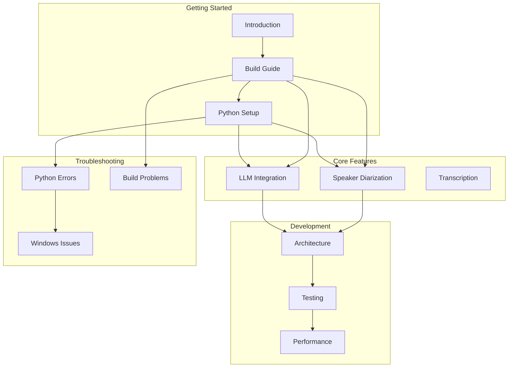

# FlowRecap Documentation

Welcome to the FlowRecap documentation! This site provides comprehensive guides for setting up, developing, and troubleshooting the FlowRecap application.

## Quick Navigation

  

    <h3>Setup Guides</h3>
    
Installation & configuration guides to get FlowRecap up and running.

    <a href="/setup/BUILD">Get Started</a>
  

  

    <h3>Feature Documentation</h3>
    
Learn about FlowRecap's powerful features including speaker diarization and LLM integration.

    <a href="/features/FEATURE_IMPLEMENTATION_SUMMARY">Explore Features</a>
  

  

    <h3>Development</h3>
    
Architecture guides, testing procedures, and contribution guidelines.

    <a href="/development/IMPLEMENTATION_NOTES">Start Contributing</a>
  

  

    <h3>Troubleshooting</h3>
    
Common issues, bug fixes, and solutions for platform-specific problems.

    <a href="/troubleshooting/WINDOWS_TROUBLESHOOTING">Find Solutions</a>
  

---

## Documentation Categories

### Setup Guides

Installation and configuration documentation to get FlowRecap running on your system.

| Document | Description |
|----------|-------------|
| [Building FlowRecap](/setup/BUILD) | Complete build instructions for all platforms |
| [Python Bundling Guide](/setup/PYTHON_BUNDLING) | How to bundle Python environment |
| [Python Environment Architecture](/setup/PYTHON_ENV_ARCHITECTURE) | Understanding the Python setup |
| [Rebuilding Python Bundle](/setup/REBUILD_BUNDLE) | Quick guide for rebuilding |
| [Windows Local Setup](/setup/WINDOWS_LOCAL_SETUP) | Windows-specific setup guide |

### Feature Documentation

Detailed documentation of FlowRecap's core features and capabilities.

| Document | Description |
|----------|-------------|
| [Feature Implementation Summary](/features/FEATURE_IMPLEMENTATION_SUMMARY) | Overview of all implemented features |
| [Speaker Diarization](/features/SPEAKER_DIARIZATION) | Multi-speaker detection and labeling |
| [Speaker Diarization Fix](/features/SPEAKER_DIARIZATION_FIX) | Recent fixes and improvements |
| [LLM Post-Processing](/features/LLM_POST_PROCESSING_INTEGRATION) | AI-powered transcript enhancement |
| [Sentiment Preservation](/features/SENTIMENT_PRESERVATION_VERIFICATION) | Maintaining sentiment accuracy |

### Development

Resources for developers contributing to FlowRecap.

| Document | Description |
|----------|-------------|
| [Implementation Notes](/development/IMPLEMENTATION_NOTES) | Technical implementation details |
| [Console Output Guide](/development/CONSOLE_OUTPUT) | Understanding console logging |
| [Manual Testing Checklist](/development/MANUAL_TESTING_CHECKLIST) | QA testing procedures |
| [Performance Optimizations](/development/PERFORMANCE_OPTIMIZATIONS_SUMMARY) | Performance improvements made |
| [Performance Testing](/development/PERFORMANCE_TESTING) | How to run performance tests |
| [Quick Performance Guide](/development/QUICK_PERFORMANCE_GUIDE) | Fast performance testing |
| [Windows Compatibility](/development/WINDOWS_COMPATIBILITY_AUDIT) | Windows platform support |

### Troubleshooting

Solutions for common issues and platform-specific problems.

| Document | Description |
|----------|-------------|
| [Windows Troubleshooting](/troubleshooting/WINDOWS_TROUBLESHOOTING) | Windows-specific issues |
| [Environment Warning Fix](/troubleshooting/BUGFIX_ENVIRONMENT_WARNING) | False positive warnings |
| [Bundle Fix Summary](/troubleshooting/BUNDLE_FIX_SUMMARY) | TorchAudio circular import fix |
| [Bundled Python Fix](/troubleshooting/BUNDLED_PYTHON_FIX) | Python detection fixes |
| [Python Bundle Fix](/troubleshooting/PYTHON_BUNDLE_FIX) | Import failure solutions |
| [Test Validation Fix](/troubleshooting/TEST_VALIDATION_FIX) | Test plan for warnings |
| [Follow-Up Summary](/troubleshooting/FOLLOW_UP_SUMMARY) | Understanding error messages |

### API Reference

API documentation for FlowRecap's interfaces.

| Document | Description |
|----------|-------------|
| [API Documentation](/api/) | Coming soon - API reference |

---

## Documentation Map

---

## Quick Links

- **Getting Started**: Start with [BUILD.md](/setup/BUILD) for build instructions
- **Python Setup**: See [PYTHON_ENV_ARCHITECTURE.md](/setup/PYTHON_ENV_ARCHITECTURE) for environment details
- **Common Issues**: Check [Troubleshooting](/troubleshooting/WINDOWS_TROUBLESHOOTING) for common problems and solutions
- **Contributing**: Review the [Implementation Notes](/development/IMPLEMENTATION_NOTES) for contribution guidelines

## Using This Documentation

### Search

Use the search bar at the top of the page (or press <kbd>Ctrl</kbd>+<kbd>K</kbd> / <kbd>Cmd</kbd>+<kbd>K</kbd>) to quickly find documentation on any topic.

### Navigation

- Use the **sidebar** on the left to browse documentation by category
- Use the **table of contents** on the right to jump to sections within a page
- Use the **previous/next** links at the bottom to navigate sequentially

### Contributing to Docs

When adding new documentation:

1. **Setup docs** go in `docs/setup/` - installation, configuration, build guides
2. **Feature docs** go in `docs/features/` - feature descriptions and usage
3. **Troubleshooting docs** go in `docs/troubleshooting/` - bug fixes, common issues
4. **Development docs** go in `docs/development/` - architecture, testing, contributing
5. **API docs** go in `docs/api/` - API references and integration guides

